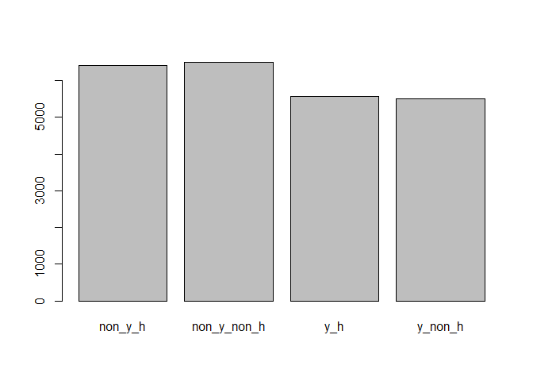
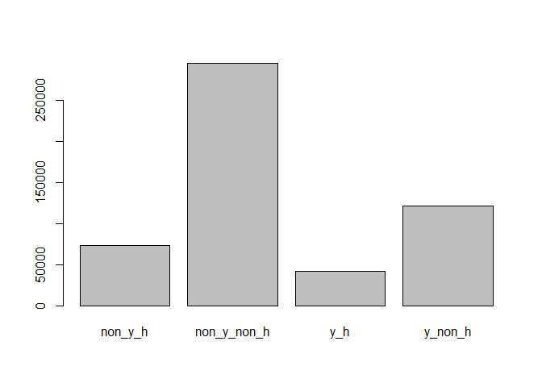

# League Of Women Voters Voting Problem
Johnny Quick  
July 4, 2016  

## League of Women Voters Voting Problem


```r
setwd("C:/Users/Johnny/OneDrive/LWVoters")
LWVData <- read.csv("LWV_Data.csv")

# pull out sample data into separate data frame
LWVData.Sample <- LWVData[!is.na(LWVData$flyer), ]

## Look at first 10 rows of data from sample
head(LWVData.Sample, 10)
```

```
##     VOTED2014 Young.Hispanic.Status ID.Number Voter.Status Voted.11.2012
## 39          0               non_y_h      5461            A             1
## 51          0               non_y_h      6832            A             0
## 217         0           non_y_non_h     16298            A             0
## 313         1               non_y_h     20802            A             0
## 370         0           non_y_non_h     23641            A             0
## 374         0           non_y_non_h     23821            A             0
## 406         0           non_y_non_h     25164            A             0
## 432         0           non_y_non_h     27016            A             0
## 450         1           non_y_non_h     28260            A             0
## 455         0           non_y_non_h     28523            A             0
##     Voted.Gen..Elec..09.2010 Voted.Gen..Elec..07.2008
## 39                         0                        0
## 51                         0                        0
## 217                        0                        1
## 313                        0                        1
## 370                        1                        0
## 374                        0                        1
## 406                        0                        1
## 432                        1                        0
## 450                        0                        0
## 455                        0                        0
##     Number.General.Elections Hispanic.Surname Young.Voter Eligible.2012
## 39                         1                1           0             1
## 51                         0                1           0             1
## 217                        1                0           0             1
## 313                        1                1           0             1
## 370                        1                0           0             1
## 374                        1                0           0             1
## 406                        1                0           0             1
## 432                        1                0           0             1
## 450                        0                0           0             1
## 455                        0                0           0             1
##     Eligible.2010 Eligible.2008 Young.in.2012 Young.in.2010 Young.in.2008
## 39              1             1             0             0             0
## 51              1             1             0             0             0
## 217             1             1             0             0             0
## 313             1             1             0             0             0
## 370             1             1             0             0             0
## 374             1             1             0             0             0
## 406             1             1             0             0             0
## 432             1             1             0             0             0
## 450             1             1             0             0             0
## 455             1             1             0             0             0
##       Voter.Category             type    ID control post flyer LOWPROP
## 39      Old Hispanic     Non_y_h_POST  5461       0    1     0       1
## 51      Old Hispanic     Non_y_h_POST  6832       0    1     0       1
## 217 Old Not Hispanic Non_y_non_h_POST 16298       0    1     0       1
## 313     Old Hispanic     Non_y_h_POST 20802       0    1     0       1
## 370 Old Not Hispanic Non_y_non_h_POST 23641       0    1     0       1
## 374 Old Not Hispanic Non_y_non_h_POST 23821       0    1     0       1
## 406 Old Not Hispanic Non_y_non_h_POST 25164       0    1     0       1
## 432 Old Not Hispanic Non_y_non_h_POST 27016       0    1     0       1
## 450 Old Not Hispanic Non_y_non_h_POST 28260       0    1     0       1
## 455 Old Not Hispanic Non_y_non_h_POST 28523       0    1     0       1
##           city   zip U_S__CONGRESS byear
## 39  CARROLLTON 75007            24  1937
## 51  CARROLLTON 75006            24  1911
## 217    GARLAND 75042            32  1922
## 313    GARLAND 75040            32  1938
## 370    GARLAND 75041            32  1911
## 374    GARLAND 75041            32  1927
## 406    GARLAND 75043            32  1926
## 432    GARLAND 75040            32  1928
## 450    GARLAND 75040            32  1944
## 455    GARLAND 75040            32  1931
```

In looking at the first 10 rows, none of them are young voters, and most of them are non-Hispanic. The League of Womens Voters were particularly interested in the effect on voting behavior for young and Hispanic voters because this group tended to be less likely to vote in past elections. Therefore, we need to look further into whether or not our sample is representative of young and Hispanic voters.


```r
table(LWVData.Sample$Young.Voter)
```

```
## 
##     0     1 
## 12915 11085
```

```r
table(LWVData.Sample$Young.Hispanic.Status)
```

```
## 
##     non_y_h non_y_non_h         y_h     y_non_h 
##        6416        6499        5584        5501
```
Looking at the table, we can see that less than 50 percent of the voters in the sample are young. Taking it a step further, we look at the young, Hispanic status variable, and we see that less than 25 percent of the voters in the sample are young and Hispanic.

Now, let's plot the sample data and the entire data to see the young, Hispanic status variable visually. In the plots below, we see the vast majority in the entire data set are non-young and non-Hispanic voters. This is not representative of the test that the League of Womens Voters would like to perform.

```r
plot(LWVData.Sample$Young.Hispanic.Status)
```

<!-- -->

```r
plot(LWVData$Young.Hispanic.Status)
```

<!-- -->
